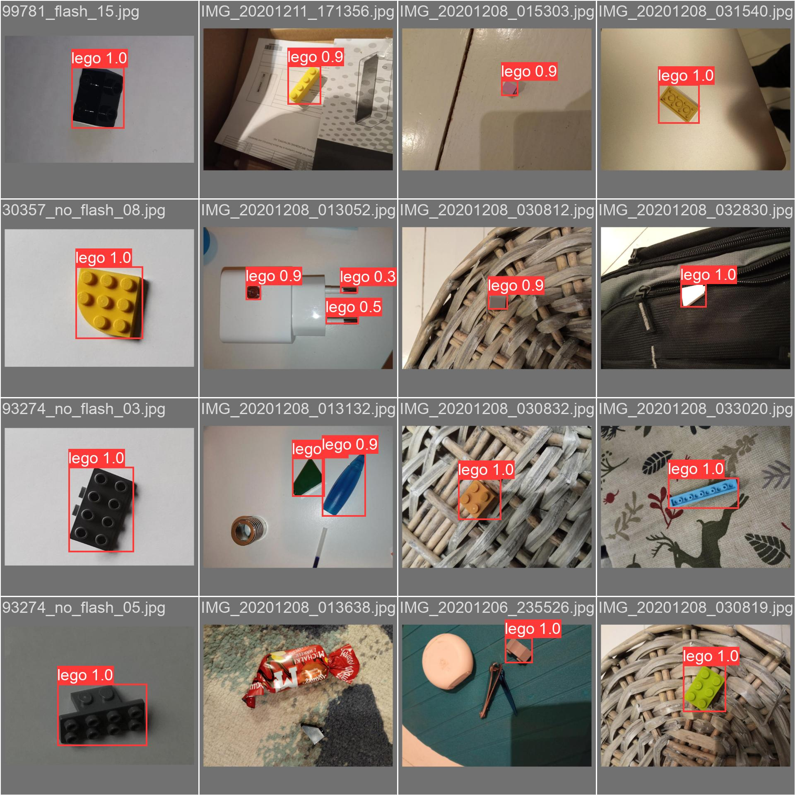
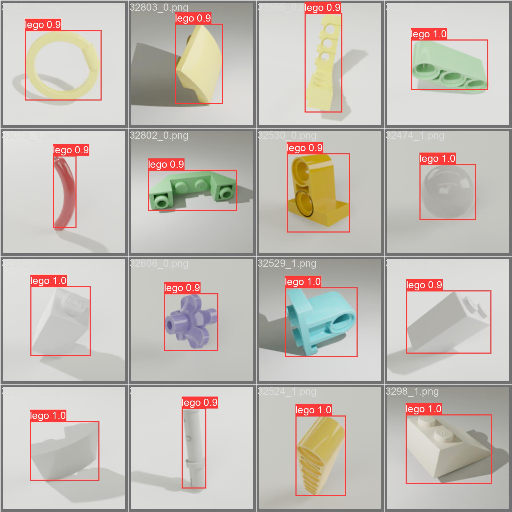
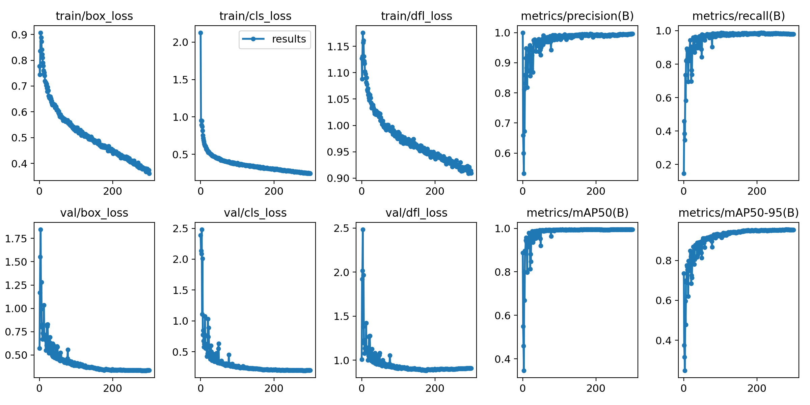

Training a detection model for identifying lego pieces on a conveyor

## Setup

```
asdf install
python -m pip install -r requirements.txt
```


## Dataset generation and training process

```
- Update the dataset name by searching and replacing across files
- Update the experiment name (optional)
- `python dataset.py`
- `python dataset-upload.py`
- `git commit ...` (use the dataset name as the commit msg)
- In Paperspace
  - `git pull`
  - `source /storage/go.sh`  (install pip dependencies and set CometML API keys)
  - `python train.py`

```

### Dataset Details

- ~3,000 images
- ~1,000 unique parts, based on [Most Common LEGO Parts (2018-2022)](https://brickarchitect.com/most-common-lego-parts/) ([most-common-2022.csv](https://github.com/brianlow/lego-inventory/blob/a25a45a1a875ee402b250d9ffe91ace5ddc4239b/most-common-2022.csv))
- 5.5 GB
- Images are combination of real images and synthetic renders
- Real images are from
  - Zawora, K., Zaraziński, S., Śledź, B., Łobacz, B., & Boiński, T. M. (2021). Tagged images with LEGO bricks [Data set]. Gdańsk University of Technology. https://doi.org/10.34808/2dbx-6a16
  - https://mostwiedzy.pl/en/open-research-data/tagged-images-with-lego-bricks,209111650250426-0
- Synthetic images rendered with my `lego-rendering` repo


## Predicting

```bash
# Update predict.py with best weights, put images in ./samples,
# run script and see results in ./tmp
python predict.py
```


## Results

- Yolo v8 Nano model
- metrics/mAP50-95: 95.3%
- 300 epochs, 2.5 hours on an A4000 I think
- see the `.pt` files for weights
- predictions take 50-80ms on my M1 Pro Macbook







Some notes
- Training on 1800k rendered images -> only good at predicting rendered images
- Training on 10 real photos with 10 blocks each -> pretty good!
- Training on classification dataset + mosaic -> meh
- yolo8n, yolo8s and yolo8m achieve similar accuracy
- resizing large images down to 1024x1024 max made a huge difference in training time (3:30 -> 0:20 per epoch)
